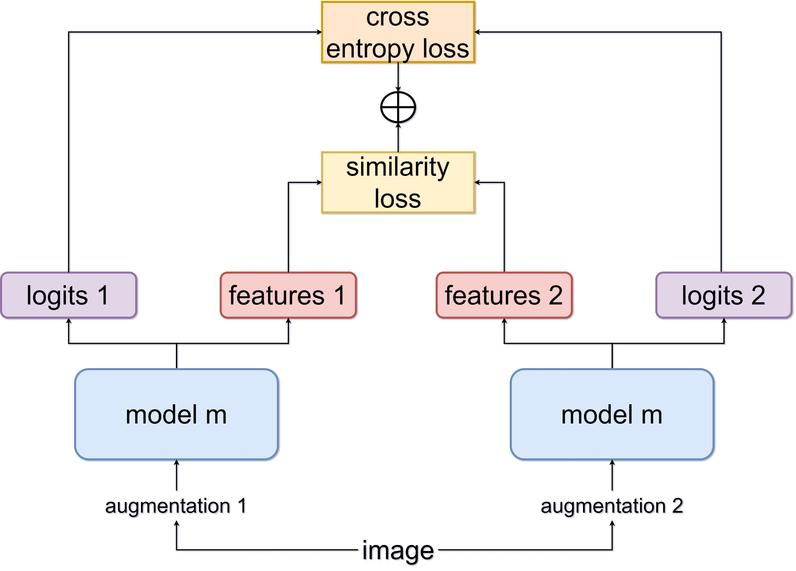

# Tied-Augment: Controlling Representation Similarity Improves Data Augmentation
This repository contains the code for [Tied-Augment: Controlling Representation Similarity Improves Data Augmentation](https://arxiv.org/abs/2305.13520) by Emirhan Kurtulus, Zichao Li, Yann Dauphin, Ekin Dogus Cubuk. 

### What is Tied-Augment?
Tied-Augment is a general framework that is applicable to a range of problems from supervised training to semi-supervised learning by amplifying the effectiveness of data augmentation through feature similarity modulation. Our framework, Tied-Augment, makes forward passes on two augmented views of the data with tied (shared) weights. In addition to the classification loss, we add a similarity term to enforce invariance between the features of the augmented views. We find that our framework can be used to improve the effectiveness of both simple flips-and-crops (Crop-Flip) and aggressive augmentations even for few-epoch training. As the effect of data augmentation is amplified, the sample efficiency of the data increases.

An overview of the Tied-Augment framework:


### Repository Structure
We present the implementation of Tied-Augment both in Jax and Pytorch frameworks. Our experiments can be replicated using the following subfolders:
- Imagenet: *flax/supervised*
- CIFAR / finetuning / SAM: *pytorch/supervised*
- Linear eval and SSL-transfer: *pytorch/ssl-transfer*
- FixMatch: *pytorch/fixmatch*

Other subfolders are in experimental stage and are not guaranteed to replicate the results. 

### Citing This Work
```bibtex
@article{kurtulus2023tiedaugment,
      title={Tied-Augment: Controlling Representation Similarity Improves Data Augmentation}, 
      author={Emirhan Kurtulus and Zichao Li and Yann Dauphin and Ekin Dogus Cubuk},
      year={2023},
      eprint={2305.13520},
      archivePrefix={arXiv},
      primaryClass={cs.CV}
}
```
